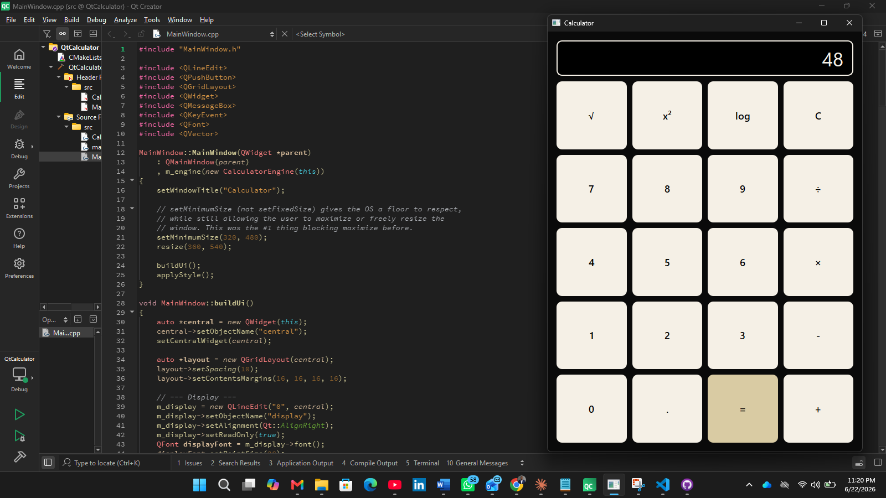

# Qt Calculator

A desktop calculator built with C++17 and the Qt 6 Widgets framework, designed around a clean separation between business logic and UI — the same architectural pattern used in production desktop and embedded software.





## Overview

This project started as a simple console-based calculator and was rebuilt into a GUI application to practice real software-engineering fundamentals: separation of concerns, the observer pattern (via Qt's signal-slot system), exception-based error handling, and unit testing.

## Architecture

The codebase is split into two independent layers:

```
src/
├── CalculatorEngine.h/.cpp   # Business logic — pure math, no UI dependency
├── MainWindow.h/.cpp         # UI layer — widgets, layout, event handling
└── main.cpp                  # Application entry point
tests/
└── test_calculator.cpp       # Unit tests for CalculatorEngine (Qt Test)
```

**Why this matters:** `CalculatorEngine` has zero knowledge of buttons, windows, or pixels. It can be unit-tested in isolation, reused in a different frontend (CLI, web API), and reasoned about independently of the UI. `MainWindow` never performs a calculation itself — it only captures user input and delegates to the engine. This mirrors the Model-View separation used in most professional GUI and web applications.

## Key Technical Decisions

| Decision | Reasoning |
|---|---|
| Code-built UI instead of `.ui` Designer files | Keeps the widget tree readable and diff-friendly in version control |
| Qt parent-child ownership for memory management | Avoids manual `delete` calls and memory leaks; widgets are automatically destroyed when their parent is |
| Exceptions for invalid operations (e.g. divide by zero) | Forces the UI layer to explicitly handle error states rather than silently displaying `inf` or `nan` |
| `qobject_cast` instead of C-style casts | Safely identifies the sender of a signal without risking undefined behavior |
| Qt Test for unit tests | Tests the engine with no GUI dependency, enabling fast, CI-friendly automated testing |

## Features

- Standard arithmetic operations: addition, subtraction, multiplication, division
- Decimal point support with duplicate-decimal prevention
- Keyboard shortcuts (Enter to calculate, Escape to clear)
- Graceful error handling for invalid operations (e.g. division by zero) via a dialog instead of a crash
- Unit-tested business logic layer
- scientific functions (√, x², log), full keyboard input support, resizable/maximizable window, custom color theme.

## Building the Project

### Prerequisites
- CMake 3.16+
- Qt 6 (Widgets module) — or Qt 5, with a one-line change noted in `CMakeLists.txt`
- A C++17-compatible compiler (GCC, Clang, or MSVC)

### Build Steps

```bash
mkdir build && cd build
cmake ..
cmake --build .
./QtCalculator        # or QtCalculator.exe on Windows
```

### Running Tests

```bash
# Uncomment the test target in CMakeLists.txt, then:
cmake --build . --target CalculatorTests
ctest
```

## Roadmap / Future Improvements

- [ ] Calculation history panel
- [ ] Trigonometric functions (sin, cos, tan)
- [ ] Dark mode theme toggle
- [ ] Persistent settings via `QSettings`

## What I Learned

Building this taught me how professional desktop applications separate concerns to stay maintainable and testable, how Qt's signal-slot mechanism implements the observer pattern, and how to design for failure (invalid input) rather than just the happy path.

## Contact

Project developed by Shadrack Owusu Ansah. Feel free to reach out via alpharianosei2005@gmail.com. 

## License

MIT
